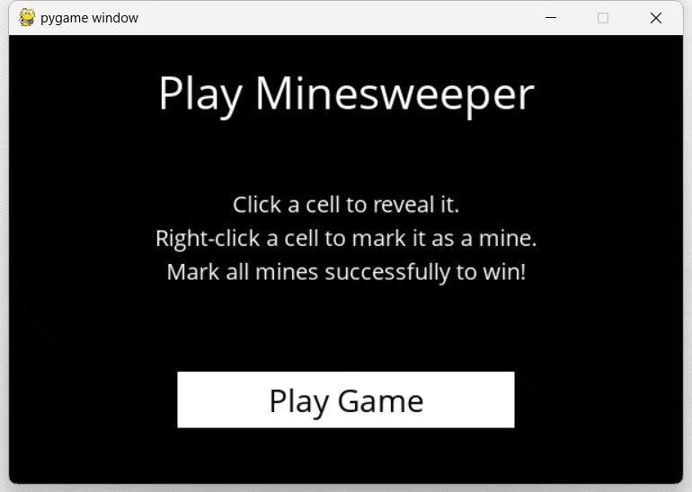

# minesweeper



The program uses logical reasoning to make informed moves and updates its knowledge dynamically based on revealed cells and mine counts.

## Minesweeper Class
The `Minesweeper` class represents the Minesweeper game. It is initialized with parameters for the height, width, and number of mines. The game board is represented as a 2D list, where mines are randomly placed. The class provides methods to print the board, check if a cell contains a mine, count nearby mines for a given cell, and check if all mines have been flagged.

## Sentence Class
The `Sentence` class represents a logical statement about the Minesweeper game. It consists of a set of board cells and a count of the number of mines among those cells. The class has methods to identify known mines and safe cells, as well as updating its internal representation based on new information.

## MinesweeperAI Class
The `MinesweeperAI` class represents the Minesweeper game player. It keeps track of moves made, known safe cells, known mines, and logical sentences about the game. The class provides methods to mark cells as mines or safe, add new information to the knowledge base, update the knowledge base, and make safe or random moves.

## MinesweeperAI Class Methods
- `mark_mine(cell)`: Marks a cell as a mine and updates knowledge accordingly.
- `mark_safe(cell)`: Marks a cell as safe and updates knowledge accordingly.
- `add_newinfo(cell, count)`: Adds new information to the knowledge base based on a cell and its neighboring mine count.
- `mark_knowledge()`: Marks safe cells and mine cells in all sentences and updates the known safe and mine sets.
- `update_knowledge()`: Tries to add new subsets into the knowledge base and removes redundant information.
- `add_knowledge(cell, count)`: Called when a safe cell is revealed, updating knowledge and making inferences based on the revealed cell and mine count.
- `make_safe_move()`: Returns a safe cell to choose on the board, known to be safe and not already chosen.
- `make_random_move()`: Returns a random move on the board that has not been chosen and is not known to be a mine.

## Usage
run ```pip install -r requirements.txt``` before run runner.py.

```bash
python runner.py
```
Note that you must switch to the current directory to execute, otherwise, it may result in errors related to font imports.
