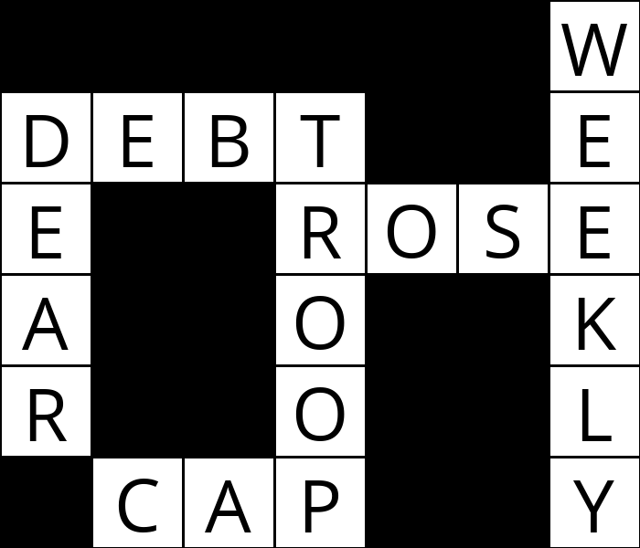

# crossword



This Python program is designed to generate and solve crossword puzzles. It utilizes a Constraint Satisfaction Problem (CSP) approach to find a valid assignment of words to the crossword grid.

## Usage

```bash
python generate.py [structure] [words]
```
- `[structure]` is txt save in `data` like `structure0`
- `[words]` is txt save in `data` like `words0`

## Classes and Methods

### `CrosswordCreator` Class

#### `__init__(self, crossword)`
- Initializes a new CSP crossword generator with the given crossword instance.

#### `letter_grid(self, assignment)`
- Returns a 2D array representing a given assignment.

#### `print(self, assignment)`
- Prints the crossword assignment to the terminal.

#### `save(self, assignment, filename)`
- Saves the crossword assignment to an image file using the PIL library.

#### `solve(self)`
- Enforces node and arc consistency, then solves the CSP using backtracking.

#### `enforce_node_consistency(self)`
- Updates `self.domains` to make each variable node-consistent by removing values inconsistent with the variable's unary constraints.

#### `revise(self, x, y)`
- Makes variable `x` arc-consistent with variable `y` by removing values from `self.domains[x]` without corresponding values in `self.domains[y]`.
- Returns True if a revision was made to the domain of `x`, False otherwise.

#### `ac3(self, arcs=None)`
- Updates `self.domains` to make each variable arc-consistent.
- If `arcs` is None, it begins with an initial list of all arcs; otherwise, it uses the provided list.
- Returns True if arc consistency is enforced and no domains are empty; False if one or more domains end up empty.

#### `assignment_complete(self, assignment)`
- Returns True if `assignment` is complete, i.e., assigns a value to each crossword variable; False otherwise.

#### `consistent(self, assignment)`
- Returns True if `assignment` is consistent, i.e., words fit in the crossword puzzle without conflicting characters; False otherwise.

#### `order_domain_values(self, var, assignment)`
- Returns a list of values in the domain of `var`, ordered by the number of values they rule out for neighboring variables.

#### `select_unassigned_variable(self, assignment)`
- Returns an unassigned variable not already part of `assignment`.
- Chooses the variable with the minimum number of remaining values in its domain. If there is a tie, it considers the variable with the highest degree.

#### `backtrack(self, assignment)`
- Uses Backtracking Search to take a partial assignment and return a complete assignment if possible.
- Returns None if no assignment is possible.

### `main()` Function

- Parses command-line arguments to obtain the structure, words, and optional output file.
- Generates a crossword puzzle using the `CrosswordCreator` class.
- Prints the result to the terminal and saves it to an image file if specified.