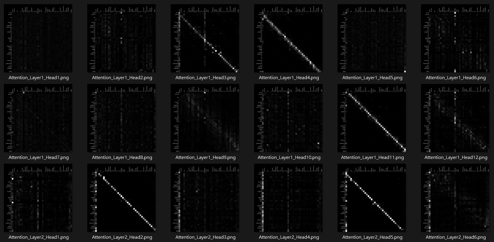

# Text-to-Attention Diagram Generator



This Python script utilizes the Hugging Face `transformers` library and TensorFlow to generate attention diagrams for a given input text using a pre-trained masked language model, such as BERT. The generated diagrams illustrate the self-attention scores of different layers and heads in the model.

## Prerequisites

```bash
pip install -r requirements.txt
```

## Usage

**Run the Script:**
```bash
python mask.py
```
- Input: Enter the text when prompted.
- Output: The script generates masked language model predictions and attention diagrams.

## Explanation

- **MODEL:** The pre-trained masked language model (e.g., "bert-base-uncased").
- **K:** Number of predictions to generate.
- **FONT:** Font for text rendering in attention diagrams.
- **GRID_SIZE:** Size of each cell in the attention diagrams.
- **PIXELS_PER_WORD:** Spacing between words in the attention diagrams.

## Functionality

1. **Tokenization:**
   - The input text is tokenized using the specified pre-trained model.

2. **Model Processing:**
   - The BERT model processes the tokenized input, generating predictions and attention scores.

3. **Predictions:**
   - Top-K predicted tokens for the masked position are printed.

4. **Attention Visualization:**
   - Attention diagrams are generated for each attention layer and head.

5. **Diagram Generation:**
   - For each attention layer and head, a diagram is created with cells shaded based on attention weights.
   - Diagrams are saved with filenames indicating the layer and head numbers.

## Note

- Ensure that the necessary font file (`OpenSans-Regular.ttf`) is available in the specified location for proper text rendering in attention diagrams.

Feel free to customize the script according to your requirements and explore different pre-trained models for varied results.